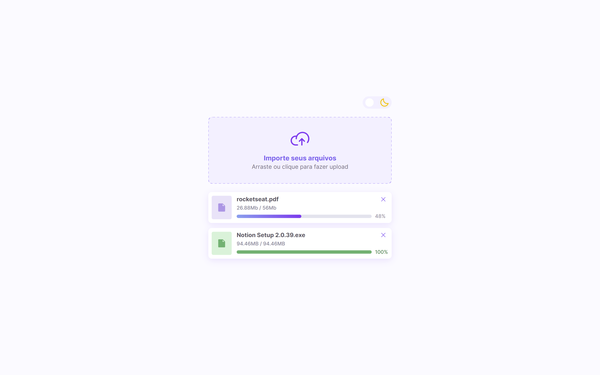

<h1 align="center"> Componente de Upload - BoraCodar#14 </h1>

[Clique aqui para acessar](https://maik-emanoel.github.io/upload-component/)

## 🚀 Tecnologias

Esse projeto foi desenvolvido com as seguintes tecnologias:

- HTML
- CSS
- JavaScript
- Git and GitHub

## 💻 Projeto

Este é um projeto de um componente de upload, onde o usuário poderá carregar seus arquivos. 

Obs: Projeto construído a partir do layout proposto no desafio [#BoraCodar14](https://boracodar.dev/) realizado pela [Rocketseat](https://rocketseat.com.br).
Após o desenvolvimento do projeto inicial, adicionei novas features, tais quais:

- Layout responsivo (Adaptado para telas menores)
- Função para adicionar novos arquivos com suas respectivas informações
- Remoção de arquivos com animação
- Exibição do progresso de carregamento dos arquivos
- Arquivos podem ser arrastados
- Efeitos hover e animações
- Adição de um tema dark
- Entre outras pequenas modificações.

## 🔖 Layout

Você pode visualizar o layout do projeto proposto através [DESSE LINK](https://www.figma.com/community/file/1225440656930547927). É necessário ter conta no [Figma](https://figma.com) para acessá-lo.